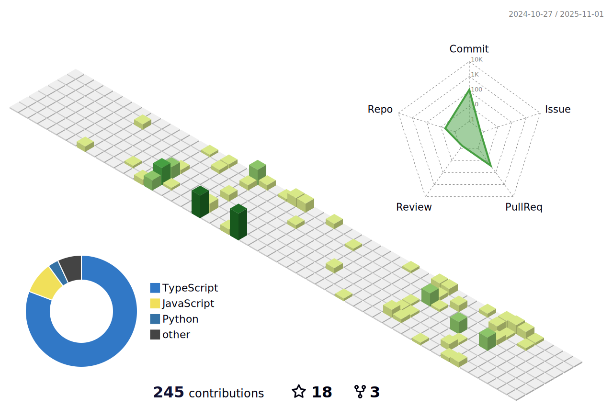

### Hello, folks 👋

My name is Ambreen Khan & I am a software testing professional. My nearly 15 years of experience in Information Technology is definitely varied, ranging from Web Site Development to Testing & Automation. Passion for quality is what drives me and I like to follow best practices whenever possible.

As someone who has done both, software development & testing, I would say I have an equal appreciation for both. I like to be able to create software that can “drive” other software as part of a test. This allows me to keep both my Tester & Developer mindset’s working and thinking.

Want to know more about me? Checkout my [portfolio](https://ambreenkhan.netlify.app/).

### 🛠️ Languages and Tools

                                                

&nbsp;

### ✍️ Blog & Writing
Apart from testing, I also love to share my knowledge. Check out my articles:

* [My Blog: Tech Journal](https://ambreenkhan.dev/)
* [My Blog: Software Testing Trends](https://softwaretestingtrends.com/)
* [Free Code Camp](https://www.freecodecamp.org/news/author/ambreenkhan/)
* [Medium Articles](https://medium.com/@ambysan)
* [Github Wiki: Tech Journal](https://arkhangelsk.github.io/TechJournal/)

### 📹 As a YouTuber
I am passionate about TESTING, LEARNING, PRODUCTIVITY & AI and love to share my newest experiments in these domains on my YouTube channels:
* [Learning Expressway](https://www.youtube.com/@learningexpressway)
* [Software Testing Trends](https://www.youtube.com/@softwaretestingtrends)
  
### 👩🏽‍🏫 As an Instructor
I like to educate and motivate others to start their test automation exploration through my course on Udemy:   
* [Roadmap to become a Test Automation Engineer](https://www.udemy.com/course/road-map-to-become-test-automation-engineer/?referralCode=0CF887F5712A3306049F)

### 📫 Connect With Me

[comment]: <> (Code To Render Snake GIF)

  <h2>🐍 My Contributions 🐍</h2>
  
    

[comment]: <> (Code To Render 3D Commit Table)

  

<!--
**arkhangelsk/arkhangelsk** is a ✨ _special_ ✨ repository because its `README.md` (this file) appears on your GitHub profile.

* Twitter: https://twitter.com/ambysan
* Facebook: https://www.facebook.com/softwaretestingtrend
* LinkedIn: https://www.linkedin.com/in/ambysan/

Here are some ideas to get you started:

- 🔭 I’m currently working on ...
- 🌱 I’m currently learning ...
- 👯 I’m looking to collaborate on ...
- 🤔 I’m looking for help with ...
- 💬 Ask me about ...
- 📫 How to reach me: ...
- 😄 Pronouns: ...
- ⚡ Fun fact: ...
-->
